# Procesverslag
Markdown is een simpele manier om HTML te schrijven.  
Markdown cheat cheet: [Hulp bij het schrijven van Markdown](https://github.com/adam-p/markdown-here/wiki/Markdown-Cheatsheet).

Nb. De standaardstructuur en de spartaanse opmaak van de README.md zijn helemaal prima. Het gaat om de inhoud van je procesverslag. Besteedt de tijd voor pracht en praal aan je website.

Nb. Door *open* toe te voegen aan een *details* element kun je deze standaard open zetten. Fijn om dat steeds voor de relevante stuk(ken) te doen.

## Jij

uitwerken voor kick-off werkgroep

### Auteur:
Sofia Yang

#### Je startniveau:
Blauw of rood.

#### Je focus:
Responsive
 

## Je website

uitwerken voor kick-off werkgroep

### Je opdracht:
https://thecosine.com/

#### Screenshot(s) van de eerste pagina (small screen): 
Homepagina
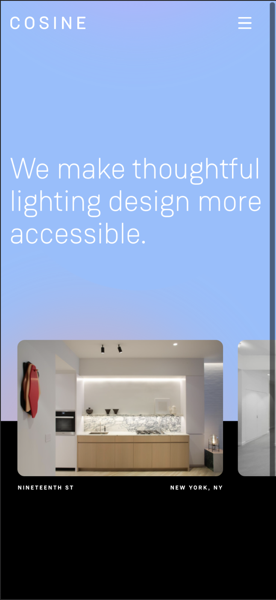

#### Screenshot(s) van de tweede pagina (small screen):
Homepagina
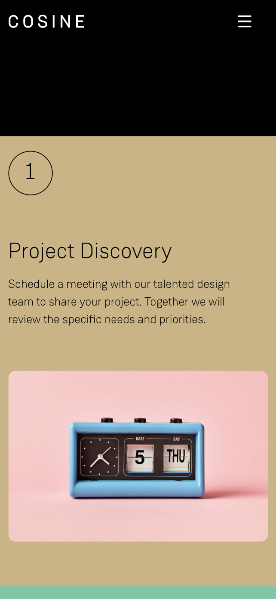
 

## Breakdownschets (week 1)

uitwerken na afloop 2e werkgroep

### de hele pagina: 
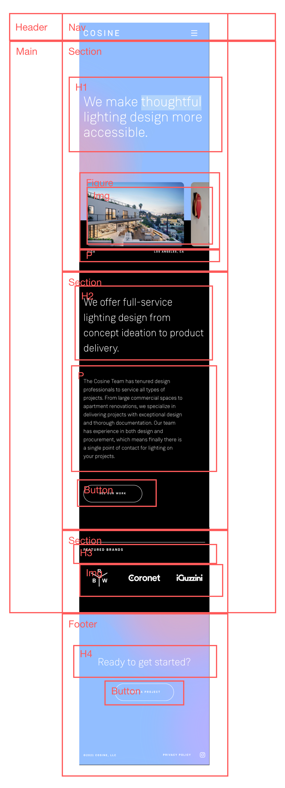

### dynamisch deel (bijv menu): 
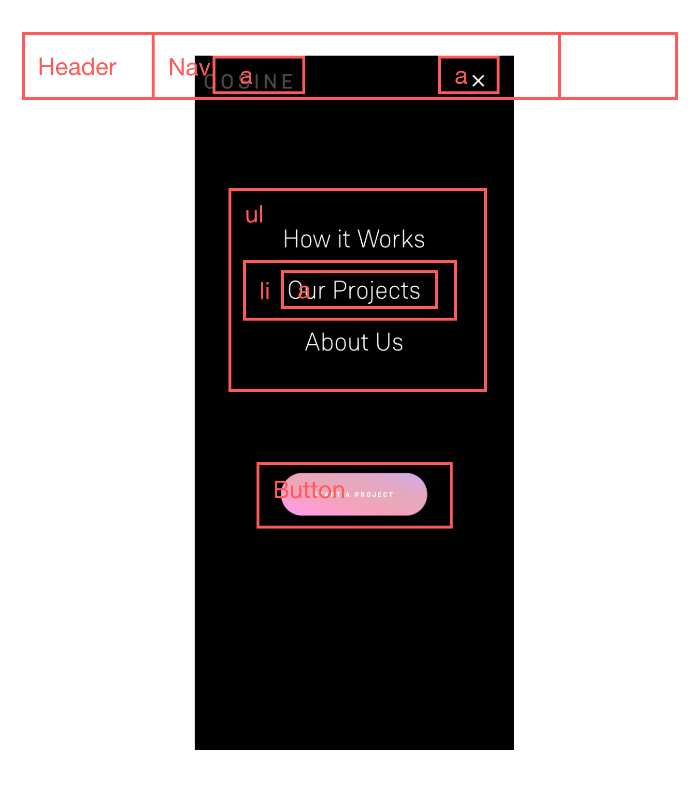

## Voortgang 1 (week 2)

uitwerken voor 1e voortgang

### Stand van zaken
Ik ben nog niet zo ver en heb alleen nog maar de HTML structuur opgebouwd.

### Verslag van meeting
- Feedback: Mijn HTML ziet er goed en netjes uit, ga zo door.

## Voortgang 2 (week 3)

uitwerken voor 2e voortgang

### Stand van zaken
Ik werk wat langzamer, waardoor ik nog niet heel veel heb. Maar het coderen zelf ging vrij soepel! Ik ben nog niet tegen grote problemen aangekomen en los mijn problemen tot nu toe vrij snel op. Als ik het op github upload, krijg ik een error waarbij mijn beelden niet te zien zijn. Ik ben er ook nog niet achter hoe ik de HR links iets korter maak.

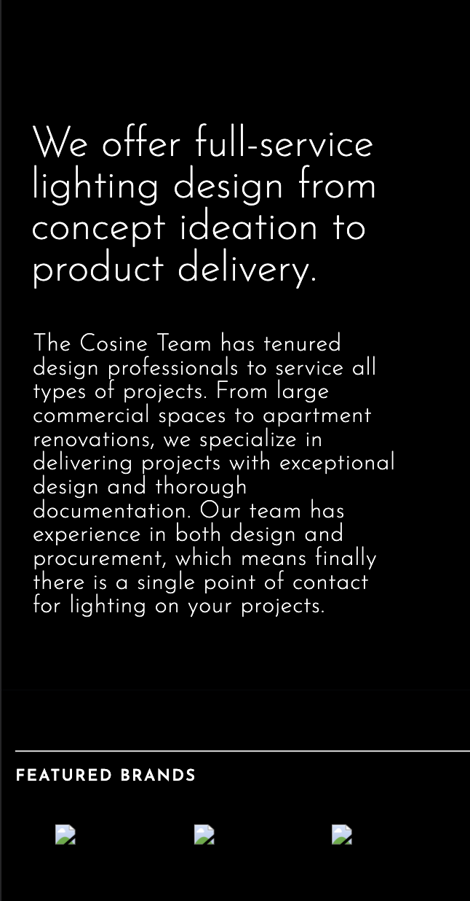

### Verslag van meeting
- Feedback: Site ziet er goed uit, gewoon zo doorgaan.
- Ik moet nog kijken naar de github error, weet niet precies waar die aan ligt.

## Toegankelijkheidstest (week 4)

uitwerken na test in 8e voortgang

Ik was er deze les niet..

### Bevindingen
Lijst met je bevindingen die in de test naar voren kwamen:

#### Titel eerste bevinding
Hier korte omschrijving (met indien nodig een afbeelding)

Hier een omschrijving van hoe het opgelost kan worden (met indien nodig een afbeelding)

#### Titel tweede bevinding. 
Hier korte omschrijving (met indien nodig een afbeelding)

Hier een omschrijving van hoe het opgelost kan worden (met indien nodig een afbeelding)

#### Titel volgende bevinding. 
Hier korte omschrijving (met indien nodig een afbeelding)

Hier een omschrijving van hoe het opgelost kan worden (met indien nodig een afbeelding)

#### Titel nog een bevinding. 
Hier korte omschrijving (met indien nodig een afbeelding)

Hier een omschrijving van hoe het opgelost kan worden (met indien nodig een afbeelding)

## Voortgang 3 (week 4)

uitwerken voor 3e voortgang

### Stand van zaken
Het gaat nog steeds best soepel. Ik ben tegen een probleem aan gekomen met de achtergrond van de pagina, het lukte niet om de svg full screen te krijgen. Maar na wat hulp kwam ik achter een nieuwe oplossing voor de achtergrond, die ik gelijk ook kon animeren! Ik kwam ook tegen het problemen aan bij de hamburger menu.

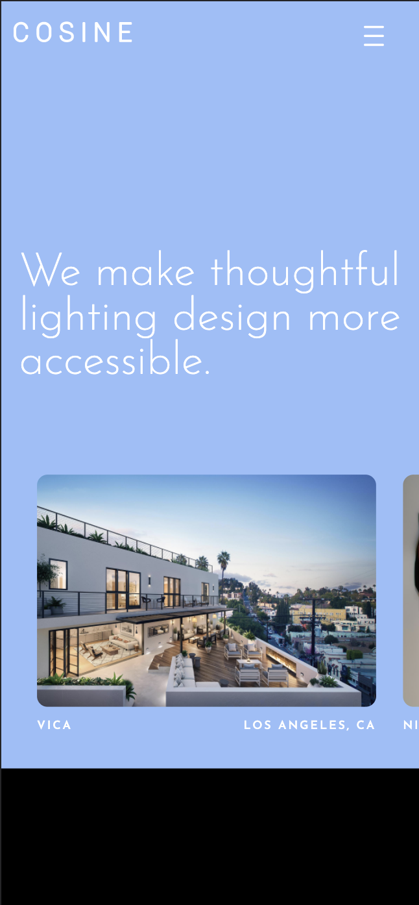

### Verslag van meeting
- Feedback: Proberen om iets minder classes te gebruiken.
- Feedback: Plaats een # in de a links.
- Feedback: Kijk naar wat je kan doen in de tijd, die je nog over hebt. Doe eerst de belangrijke punten.

## Eindgesprek (week 5)

uitwerken voor eindgesprek

### Stand van zaken
Ik heb eindelijk de hamburger menu laten werken. Ik heb het gevoel dat de menubar mijn het meeste tijd heeft gekost van de hele site.. ;-; Dit is het grootste probleem waar ik tegen aan liep. Verder ging het wel redelijk. Er zijn wel kleine dingen, waar ik geen oplossing voor heb gevonden. Ook probeerde ik een infinite scroll te maken, dit is helaas niet meer gelukt.

### Screenshot(s)
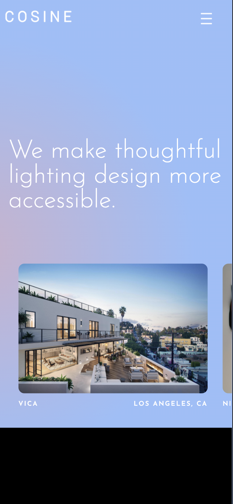
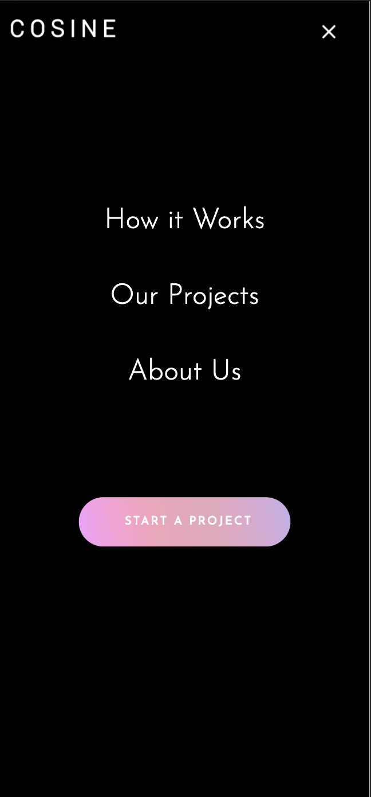
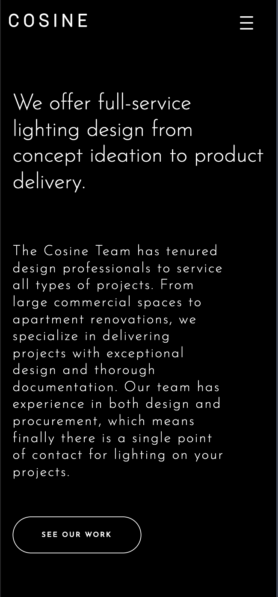
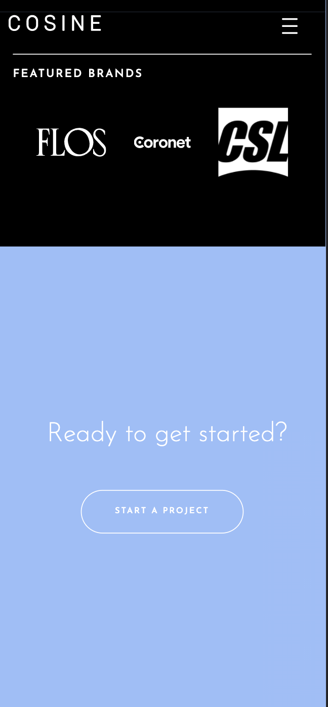
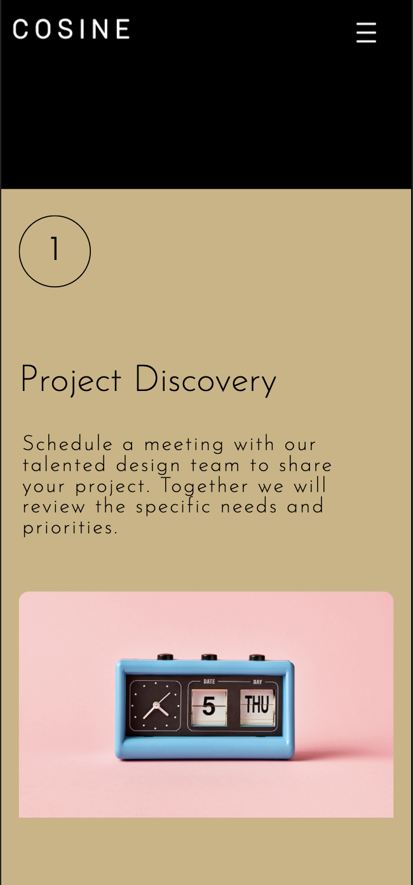

## Bronnenlijst

continu bijhouden terwijl je werkt

Nb. Wees specifiek ('css-tricks' als bron is bijv. niet specifiek genoeg).

1. https://css-tricks.com/snippets/css/a-guide-to-flexbox/
2. https://cssgradient.io/
3. https://dev.to/devggaurav/let-s-build-a-responsive-navbar-and-hamburger-menu-using-html-css-and-javascript-4gci
4. https://stackoverflow.com/questions/6121203/how-to-do-fade-in-and-fade-out-with-javascript-and-css
    

